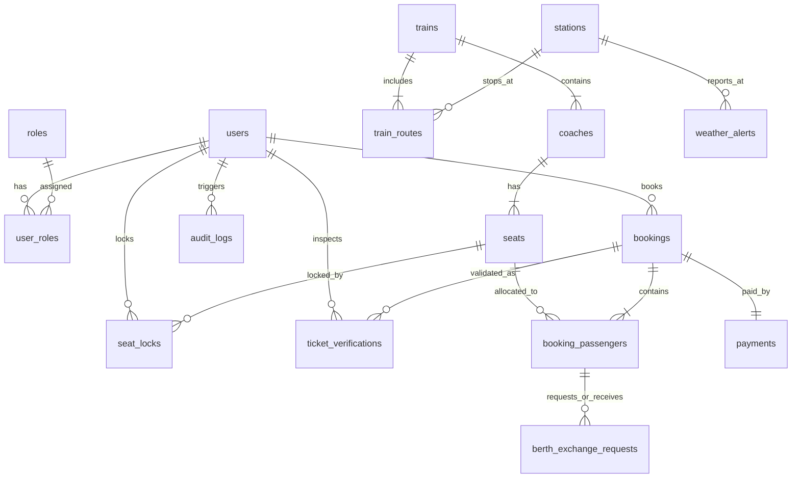

# RAILCONNECT — Relational Database Architecture

## 1. Relational Schema Overview

The RAILCONNECT database model is organized into **18 normalized relational tables** in Third Normal Form (3NF) to ensure referential integrity, eliminate duplicate records, and support high-throughput booking transactions.

The schema files are located in `railconnect-database`:
* `database/schema.sql` — 18 table DDL definitions, primary keys, foreign key cascades, and unique constraints.
* `database/seed.sql` — Master seed records for stations, fare rules, trains, routes, coaches, and seats.
* `database/sample-data.sql` — Demo passengers, pre-hashed credentials, completed bookings, and audit records.

---

## 2. Table Catalog

| Table Name | Primary Key | Description | Key Relationships |
|---|---|---|---|
| `users` | `id` (BIGINT AUTO_INCREMENT) | Passenger, TTE inspector, and admin user records | 1:M with `bookings`, `audit_logs` |
| `roles` | `id` (INT AUTO_INCREMENT) | System roles (`ROLE_PASSENGER`, `ROLE_INSPECTOR`, `ROLE_ADMIN`) | M:M with `users` via `user_roles` |
| `user_roles` | Composite (`user_id`, `role_id`) | Join table mapping users to RBAC permissions | FK to `users(id)`, `roles(id)` |
| `stations` | `id` (BIGINT AUTO_INCREMENT) | Railway stations, codes, city, state, coordinates | 1:M with `train_routes`, `trains` |
| `trains` | `id` (BIGINT AUTO_INCREMENT) | Master train schedules, speed, distance, active status | 1:M with `train_routes`, `coaches` |
| `train_routes` | `id` (BIGINT AUTO_INCREMENT) | Intermediate stops, sequence, arrival/departure times, distance | FK to `trains(id)`, `stations(id)` |
| `coaches` | `id` (BIGINT AUTO_INCREMENT) | Physical railway coaches (S1, B1, A1, C1) and class type | FK to `trains(id)`, 1:M with `seats` |
| `seats` | `id` (BIGINT AUTO_INCREMENT) | Physical seats/berths with position type (LOWER, MIDDLE, etc.) | FK to `coaches(id)`, 1:M with `seat_locks` |
| `seat_locks` | `id` (BIGINT AUTO_INCREMENT) | Temporary 10-minute dynamic lock records for seat booking | FK to `seats(id)`, FK to `users(id)` |
| `fare_rules` | `id` (BIGINT AUTO_INCREMENT) | Dynamic fare parameters per class: base rate/km, reservation fee | Referenced by `BookingService` |
| `bookings` | `id` (BIGINT AUTO_INCREMENT) | Confirmed reservation record, 10-digit PNR, travel date, status | FK to `users(id)`, `trains(id)`, 1:M with `booking_passengers` |
| `booking_passengers` | `id` (BIGINT AUTO_INCREMENT) | Individual traveler details, assigned seat, age, concession | FK to `bookings(id)`, FK to `seats(id)` |
| `payments` | `id` (BIGINT AUTO_INCREMENT) | Payment transactions, gateway reference, mode, amount, status | FK to `bookings(id)` |
| `weather_alerts` | `id` (BIGINT AUTO_INCREMENT) | Weather events along railway tracks with severity and advisory | FK to `stations(id)` |
| `berth_exchange_requests` | `id` (BIGINT AUTO_INCREMENT) | P2P seat swap requests between co-passengers on the same train | FK to `booking_passengers(id)` (requester & target) |
| `ticket_verifications` | `id` (BIGINT AUTO_INCREMENT) | Onboard TTE inspector ticket validation log entries | FK to `bookings(id)`, FK to `users(id)` (inspector) |
| `audit_logs` | `id` (BIGINT AUTO_INCREMENT) | Immutable system audit log for security and mutation tracking | FK to `users(id)` |
| `admin_profiles` | `id` (BIGINT AUTO_INCREMENT) | Extended administrative profile and department metadata | FK to `users(id)` |

---

## 3. Entity-Relationship Diagram (ERD)



---

## 4. Key Constraints & Data Integrity

1. **Unique 10-Digit PNR Constraint**:
   ```sql
   ALTER TABLE bookings ADD CONSTRAINT uq_bookings_pnr UNIQUE (pnr);
   ```
   Ensures that every passenger name record is uniquely addressable across the railway ledger.

2. **Single Active Dynamic Lock Constraint**:
   A composite index on `(seat_id, journey_date)` prevents duplicate locks from being acquired on the same seat for the same departure date concurrently.

3. **Atomic Berth Exchange Swap Integrity**:
   Foreign key links ensure that exchange requests can only be placed between active `booking_passengers` traveling on the same train on the identical date.

4. **Immutable Audit Ledger**:
   `audit_logs` records actions such as `BOOKING_CREATED`, `SEAT_LOCKED`, `BERTH_EXCHANGE_EXECUTED`, and `TICKET_CANCELLED` with IP address, user identifier, and ISO timestamp.
